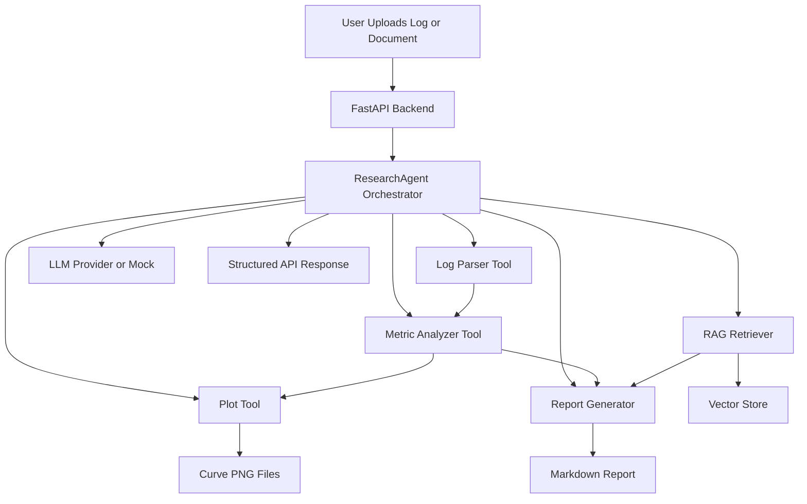
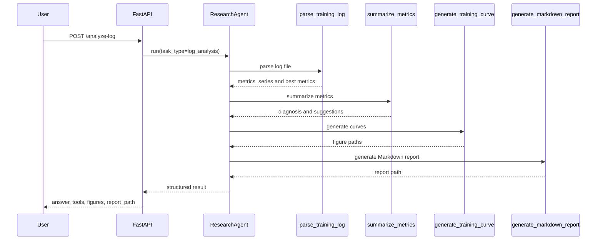
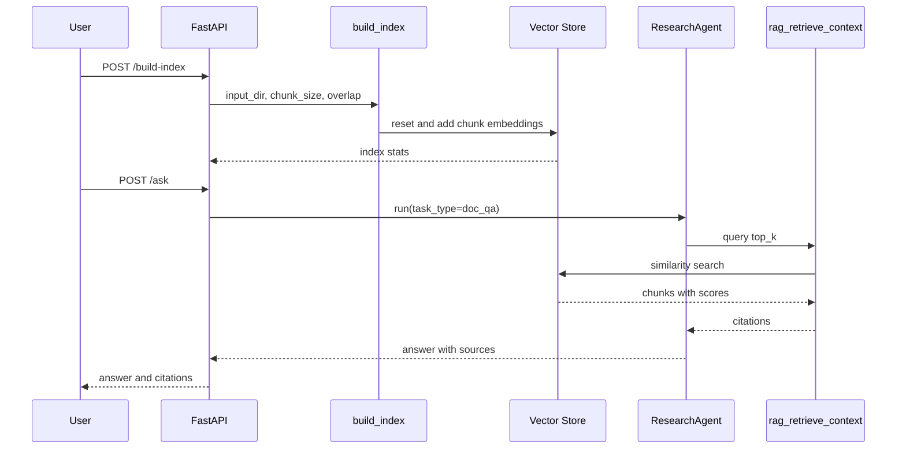

# Plant3D Research Agent 架构说明

## 项目整体架构

Plant3D Research Agent 由 FastAPI 后端、Streamlit 前端、Agent 编排层、工具层、RAG 层和 LLM Provider 层组成。核心思想是让 Agent 只做编排和决策，把可验证的计算交给确定性工具。

## 模块说明

| 模块 | 作用 |
| --- | --- |
| `app/` | FastAPI 接口，处理上传、分析、问答、索引构建和文件下载 |
| `frontend/` | Streamlit Demo UI |
| `agent/` | 任务分类、工具调用编排、结果聚合 |
| `tools/` | 日志解析、指标总结、模型对比、绘图、报告生成 |
| `rag/` | 文档加载、切分、向量存储、召回 |
| `llm/` | Mock LLM 和 OpenAI-compatible provider |
| `examples/` | 样例日志、指标表和论文笔记 |
| `tests/` | parser、metric、report、API 和 RAG 冒烟测试 |

## 数据流说明

1. 用户上传 `.log`、`.txt`、`.md`、`.csv`、`.json` 或 `.pdf` 文件。
2. FastAPI 保存到 `uploads/`，返回文件路径。
3. 日志分析时，Agent 调用 parser 提取 `metrics_series`。
4. Analyzer 生成 best/final metric、诊断和建议。
5. Plotter 根据 metric series 输出曲线图。
6. Report generator 汇总指标、图表和 RAG citation，生成 Markdown。
7. 文档 QA 时，Retriever 从本地向量库召回片段，Agent 组合回答与来源。

## Agent 工作流说明

`ResearchAgent.run()` 接收 query、file paths 和可选 task type。若未指定 task type，会按 query 关键词和文件后缀做轻量分类：

- `log_analysis`：训练日志解析、曲线、诊断、报告。
- `report_generation`：偏报告生成，复用日志分析工具链。
- `model_compare`：多个日志或 CSV 指标表对比。
- `doc_qa`：RAG 检索回答文档问题。
- `general_advice`：用已有 RAG context 和 LLM/mock 生成建议。

路由优先级中，携带 `.log` 或 `.txt` 日志文件的解释型问题会优先进入 `log_analysis`，这样 `Why is stem IoU lower than leaf IoU?` 这类问题会同时触发日志解析、指标诊断、曲线和报告生成。只有明确包含 `paper`、`document`、`论文`、`文档` 或 `RAG` 等文档意图时，才走纯 `doc_qa`。

## Tool Calling 流程说明

Tool Calling 在本项目中是显式 Python 函数调用，而不是依赖黑盒 Agent 框架。好处是稳定、可测试、容易讲清楚。

## RAG 流程说明

RAG 主要服务于论文笔记、实验记录、指标解释和方法背景问答。

1. `load_documents()` 读取 uploads 或 examples 中的文档。
2. `split_documents()` 按 chunk size 和 overlap 切分。
3. `create_vector_store()` 根据环境变量选择 `simple-json` 或 `chroma`。
4. 默认 `HashingEmbeddingProvider` 生成本地向量，避免 Demo 依赖外部 API。
5. `rag_retrieve_context()` 返回 top-k chunks、source 和 score。
6. Agent 把 citation 放入回答和报告。

